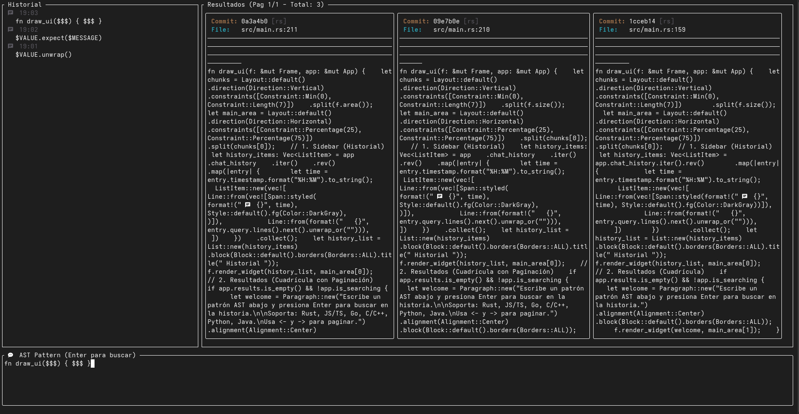

# 🦀 Git AST Search TUI

**Git AST Search** es una herramienta de terminal (TUI) de alto rendimiento diseñada para la minería de código histórica. A diferencia de las herramientas de búsqueda tradicionales basadas en texto plano o expresiones regulares (Regex), esta herramienta utiliza **Análisis de Árboles de Sintaxis Abstracta (AST)** para encontrar estructuras de código exactas, ignorando comentarios, espacios en blanco o saltos de línea, a través de *toda* la historia de un repositorio Git.

---



---

## 🌟 ¿Por qué Git AST Search? (Perspectivas del Proyecto)

### 1. Perspectiva de Rendimiento: Escaneo Cero-Redundante en O(1)
El motor no realiza *checkouts* de Git ni toca el disco duro. Lee directamente de la base de datos de objetos (Blobs). Además, implementa una **deduplicación concurrente agresiva**: si un archivo no ha cambiado entre 1,000 commits, el motor solo lo escanea *una vez*. Esto reduce tiempos de búsqueda de minutos a milisegundos en repositorios masivos.

### 2. Perspectiva Multipolíglota
Ya no está limitado a Rust. El motor detecta automáticamente la extensión del archivo en cada commit y asigna el parser de lenguaje correcto en tiempo real. Soporta:
* 🦀 Rust (`.rs`)
* 🌐 JavaScript / TypeScript (`.js`, `.jsx`, `.ts`, `.tsx`)
* 🐹 Go (`.go`)
* 🐍 Python (`.py`)
* ☕ Java (`.java`)
* ⚙️ C / C++ (`.c`, `.cpp`, `.cc`, `.cxx`)

### 3. Perspectiva de Experiencia de Usuario (UI/UX)
Diseñado para el "Flujo de trabajo Terminal-First". Incluye un historial de búsquedas lateral para mantener el contexto de tus investigaciones y una vista de resultados en formato de tarjetas con paginación fluida, evitando saturar la pantalla.

---

## 🚀 Stack Tecnológico

Construido sobre un ecosistema de **Rust** enfocado en seguridad de memoria y paralelismo masivo:

| Componente | Tecnología | Descripción |
| :--- | :--- | :--- |
| **Interfaz (TUI)** | `ratatui` | Framework de renderizado inmediato para interfaces de terminal fluidas. |
| **Motor AST** | `ast-grep` | Framework de búsqueda estructural super-rápido basado en `tree-sitter`. |
| **Motor Git** | `libgit2` | Interacción en C puro y bajo nivel con la base de datos de objetos de Git. |
| **Deduplicación** | `dashmap` | Estructura de datos concurrente `Lock-Free` para el registro global de Blobs. |
| **Paralelismo** | `rayon` | Distribución dinámica de *chunks* de commits a través de todos los núcleos de CPU. |
| **Async & Eventos** | `tokio` / `mpsc` | Canales para enviar resultados desde el motor hacia la UI sin bloquear el renderizado. |

---

## 📦 Instalación

Para compilar este proyecto, necesitas las librerías de desarrollo del sistema operativo.

**En Fedora / RHEL:**
```bash
sudo dnf install cmake openssl-devel libgit2-devel zlib-devel
```

**En Ubuntu / Debian:**
```bash
sudo apt install cmake libssl-dev libgit2-dev zlib1g-dev
```

**Compilación del proyecto:**
```bash
git clone [https://github.com/plantacerium/Git-AST-Search](https://github.com/plantacerium/Git-AST-Search)
cd Git-AST-Search
# Compilado con LTO (Link Time Optimization) y Strip para máxima velocidad
cargo build --release
```

---

## 🛠️ Guía de Uso

Inicia la herramienta pasando la ruta del repositorio Git como argumento (por defecto es el directorio actual):

```bash
# Analizar el repositorio actual
./target/release/git-ast-search .

# Analizar un proyecto externo masivo
./target/release/git-ast-search /home/user/dev/linux
```

### 🎮 Controles de la TUI
* **Teclado Alfanumérico:** Escribe tu patrón AST directamente en la barra de búsqueda inferior.
* **Enter:** Inicia la búsqueda estructural en todas las ramas y commits alcanzables.
* **Flechas Izquierda (<-) / Derecha (->):** Navega entre las páginas de resultados.
* **Esc:** Aborta la búsqueda actual o cierra la aplicación.

---

## 🔍 Ejemplos de Búsqueda Semántica Multipolíglota

Aprovecha el poder de `ast-grep` usando el comodín `$$$` (cero o múltiples nodos) y variables como `$A`, `$B` (nodos específicos). Aquí tienes casos de uso reales para auditoría de código en el historial:

### 🦀 Rust (`.rs`)
* **Buscar código "inseguro" (Unsafe blocks):**
    Útil para auditar cuándo se introdujeron bloques de memoria manual.
    `unsafe { $$$ }`
* **Encontrar antiguas fugas de memoria o desempaquetados de riesgo:**
    `$OBJ.unwrap()` o `$OBJ.expect($ANY)`
* **Localizar errores silenciados explícitamente:**
    `let _ = $FUNC($$$);`
* **Funciones que usaban `panic!` en versiones tempranas:**
    `panic!($$$)`

### 🌐 JavaScript / TypeScript (`.js`, `.ts`, `.jsx`, `.tsx`)
* **Buscar `console.log` que se escaparon a producción en el pasado:**
    `console.log($$$)`
* **Encontrar "Callback Hell" o promesas anidadas:**
    `$A.then(($B) => { $$$}).then(($C) => {$$$ })`
* **Detectar el uso de igualdad débil (propenso a bugs):**
    `$A == $B` o `$A != $B`
* **Bloques `catch` vacíos (Fallos silenciosos):**
    ```javascript
    catch ($E) { }
    ```

### 🐍 Python (`.py`)
* **Trampas de argumentos por defecto mutables (Bug clásico de Python):**
    `def $FUNC($ARG = []): $$$` o `def $FUNC($ARG = {}): $$$`
* **Localizar bloques de captura de errores donde no se hizo nada (Silenced errors):**
    ```python
    try:
        $$$
    except $ERR:
        pass
    ```
* **Buscar usos de `eval()` (Riesgo de inyección de código):**
    `eval($$$)`

### 🐹 Go (`.go`)
* **Identificar dónde se ignoraron errores deliberadamente:**
    `$VAL, _ := $FUNC($$$)`
* **Buscar goroutines anónimas que podrían estar causando fugas:**
    ```go
    go func() {
        $$$
    }()
    ```
* **Puntos críticos donde la aplicación forzaba cierres:**
    `panic($$$)`

### ☕ Java (`.java`)
* **Rastros de "Print Debugging" dejados por desarrolladores:**
    `System.out.println($$$);` o `e.printStackTrace();`
* **Captura excesivamente genérica de excepciones:**
    ```java
    catch (Exception $E) {
        $$$
    }
    ```
* **Uso de la clase `Thread` directamente en lugar de `Executors`:**
    `new Thread($$$).start();`

### ⚙️ C / C++ (`.c`, `.cpp`)
* **Funciones inseguras de manipulación de cadenas (Buffer Overflows):**
    `strcpy($DEST, $SRC)` o `sprintf($$$)`
* **Gestión de memoria manual (Posibles Memory Leaks):**
    `delete $PTR;` o `free($PTR);`
* **Macros problemáticas del preprocesador:**
    `#define $MACRO($ARGS) $$$`
## ⚙️ Arquitectura Interna del Motor (Optimización)

El núcleo del motor resuelve el problema del "Escaneo Cuadrático" clásico de las búsquedas en el historial de Git.

1.  **Recreación de la Topología:** Obtiene todos los `Oid` (Object IDs) de los commits desde `HEAD`.
2.  **Chunking Local-Thread:** Divide los commits en lotes (chunks) de 100. Cada hilo de `Rayon` levanta su propia instancia de `Repository` (saltando cuellos de botella de mutex en C).
3.  **El Muro de Caché (DashSet):** Por cada archivo (Tree Entry), extrae su Hash SHA-1 único. Si ese SHA-1 ya existe en nuestro `DashSet`, el hilo lo descarta en `O(1)`. Si es nuevo, lo convierte a texto y genera un árbol sintáctico `Tree-sitter` para la búsqueda.

---

## 📄 Licencia
Este proyecto está distribuido bajo la Licencia MIT. Siéntete libre de usarlo, modificarlo y distribuirlo para empujar los límites de la minería de código estática.
```
