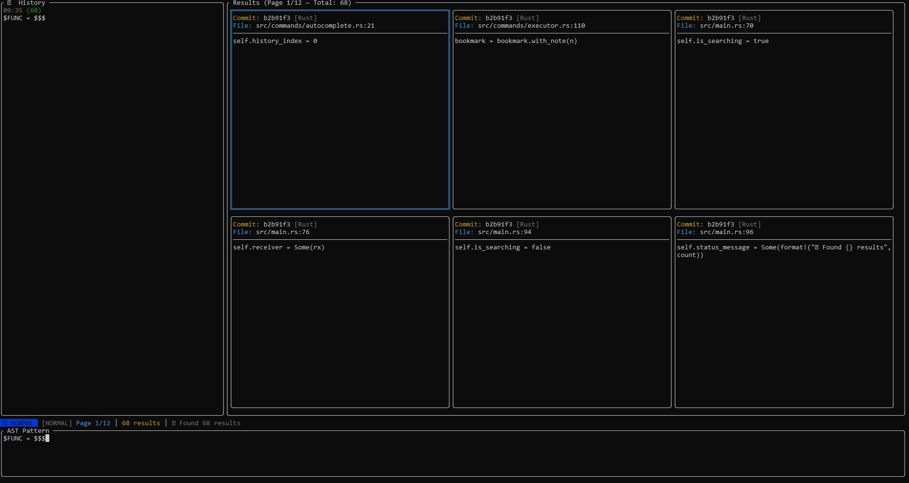

# 🦀 Git AST Search TUI v0.2.1

**Git AST Search** is a high-performance terminal user interface (TUI) tool designed for historical code mining. Unlike traditional search tools based on plain text or Regular Expressions (Regex), this tool leverages **Abstract Syntax Tree (AST) Analysis** to find exact code structures—ignoring comments, whitespace, or line breaks—across the *entire* history of a Git repository.

### ✨ What's New in v0.2.1
* **High-Level Modular UI**: Full interface refactor into independent components (`sidebar`, `results_grid`, `search_bar`, `status_bar`).
* **Atomic Layout Logic**: Dimension calculations decoupled from rendering logic for improved stability and smoothness.
* **Command System (Slash Commands)**: Full support for `/search`, `/export`, `/bookmark`, `/sessions`, `/patterns` commands and their aliases.
* **Advanced Vim-style Navigation**: Autocomplete history with `Tab`, `j/k/h/l` keys for results/pages, and Visual Mode `v`.

---



---

## 🌟 Why Git AST Search? (Project Perspectives)

### 1. Performance Perspective: Zero-Redundant O(1) Scanning
The engine does not perform Git checkouts or touch the hard drive during scans. It reads directly from the Git object database (Blobs). Furthermore, it implements **aggressive concurrent deduplication**: if a file hasn't changed across 1,000 commits, the engine only scans it *once*. This reduces search times from minutes to milliseconds even in massive repositories.

### 2. Multi-Polyglot Perspective
It's no longer limited to Rust. The engine automatically detects the file extension in each commit and assigns the correct language parser in real-time. Supported languages include:
* 🦀 Rust (`.rs`)
* 🌐 JavaScript / TypeScript (`.js`, `.jsx`, `.ts`, `.tsx`)
* 🐹 Go (`.go`)
* 🐍 Python (`.py`)
* ☕ Java (`.java`)
* ⚙️ C / C++ (`.c`, `.cpp`, `.cc`, `.cxx`)

### 3. Modular UI/UX Perspective
Designed for a "Terminal-First Workflow". v0.2.1 introduces a UI architecture based on atomic components. This allows for total granularity:
* **Historical Sidebar**: Maintain context of all your previous investigations.
* **Contextual Search**: Intelligent input that changes dynamically based on the mode (Search vs Command).
* **High-Performance Grid**: Optimized pagination to avoid saturating the terminal buffer even with thousands of results.

### 4. Professional Navigation Perspective (Vim-style)
Familiar controls for developers. It implements a state system (`NavMode`) that allows toggling between fast navigation, visual selection of code blocks, and command execution without leaving the keyboard.

---

## 📁 Project Structure v0.2.1

```
Git-AST-Search/
├── src/
│   ├── main.rs                   # Main loop and orchestration
│   ├── ui/                        # Modular User Interface
│   │   ├── mod.rs                # UI Entry point
│   │   ├── app.rs                # Global state and App handlers
│   │   ├── render.rs             # Drawing functions (Frame orchestration)
│   │   ├── layout.rs             # Geometric calculations and constraints
│   │   ├── events.rs             # Crossterm event bridge (WIP)
│   │   └── components/           # Atomic widgets
│   │       ├── mod.rs            # Component exports
│   │       ├── sidebar.rs        # Historical sidebar panel
│   │       ├── results_grid.rs   # Dynamic results grid
│   │       ├── search_bar.rs     # Command/Pattern input
│   │       ├── status_bar.rs     # Mode and status information
│   │       └── help_overlay.rs   # Help and Welcome screens
│   ├── modules/                   # Data models
│   │   ├── mod.rs
│   │   ├── search_result.rs       # SearchResult entity
│   │   ├── chat_entry.rs          # Query history model
│   │   ├── session.rs             # Session persistence and management
│   │   ├── bookmark.rs            # Result bookmarks
│   │   ├── filter.rs              # Filtering logic
│   │   └── config.rs              # Configuration and Themes
│   ├── commands/                  # Slash Command Engine
│   │   ├── mod.rs
│   │   ├── parser.rs              # / command parsing
│   │   ├── executor.rs            # Command logic executor
│   │   ├── registry.rs            # Central command registry
│   │   ├── autocomplete.rs         # Suggestions and autocompletion
│   │   └── commands/              # Individual command implementations
│   │       ├── mod.rs
│   │       ├── search.rs          # /search command
│   │       └── export.rs          # /export command
│   ├── navigation/               # Navigation and Modes (Vim-style)
│   │   ├── mod.rs                 # NavigationState
│   │   └── modes.rs               # NavMode enum
│   ├── languages/                 # Parsers and Multi-polyglot Detection
│   │   ├── mod.rs
│   │   ├── registry.rs            # Language and pattern registry
│   │   ├── detector.rs            # Auto-detection by extension
│   │   └── patterns.rs            # Base AST pattern definitions
│   └── engine/                    # Core: Git2 + AST-Grep + Rayon
│       └── mod.rs                 # Search engine and Git integration
├── assets/                        # Visual assets and screenshots
├── docs/                          # Detailed documentation
├── Cargo.toml                     # Dependencies and project metadata
├── README.md                      # Spanish Documentation
└── README_ENG.md                  # English Documentation
```

---

## 🚀 Tech Stack

| Component | Technology | Description |
| :--- | :--- | :--- |
| **Interface (TUI)** | `ratatui` | Immediate-mode rendering framework for fluid terminal interfaces. |
| **AST Engine** | `ast-grep` | Super-fast structural search framework based on `tree-sitter`. |
| **Git Engine** | `git2` | Low-level C-based interaction with the Git object database. |
| **Deduplication** | `dashmap` | Lock-free concurrent data structure for global Blob registration. |
| **Parallelism** | `rayon` | Dynamic distribution of commit chunks across all CPU cores. |
| **Async & Events** | `tokio` / `mpsc` | Channels to stream results from the engine to the UI without blocking. |

---

## 📦 Installation

To compile this project, you need the system development libraries.

**On Fedora / RHEL:**
```bash
sudo dnf install cmake openssl-devel libgit2-devel zlib-devel
```

**On Ubuntu / Debian:**
```bash
sudo apt install cmake libssl-dev libgit2-dev zlib1g-dev
```

**Compiling the project:**
```bash
git clone https://github.com/plantacerium/Git-AST-Search
cd Git-AST-Search
cargo build --release
```

---

## 🛠️ Usage Guide

Start the tool by passing the Git repository path as an argument (defaults to the current directory):

```bash
./target/release/git-ast-search .
./target/release/git-ast-search /home/user/dev/linux
```

---

## 🎮 TUI Controls

### Insert Mode (Default)

| Shortcut | Action |
|----------|--------|
| `Any` | Type AST Pattern |
| `Enter` | Start search |
| `Esc` | Exit to Normal Mode |

### Normal Mode

| Shortcut | Action |
|----------|--------|
| `i` / `a` | Enter Insert Mode |
| `j` / `↓` | Next result |
| `k` / `↑` | Previous result |
| `h` / `←` | Previous page |
| `l` / `→` | Next page |
| `Esc` | Clear selection / Close |
| `Ctrl+H` | History panel |
| `Ctrl+B` | Toggle sidebar |
| `gg` | Go to first result |
| `G` | Go to last result |

### Command Mode

| Shortcut | Action |
|----------|--------|
| `/` | Enter command mode |
| `:` | Vim command mode |
| `Tab` | Autocomplete |
| `↑` / `↓` | Command history |

---

## 💻 Available Commands

### Search Commands

| Command | Description |
|---------|-------------|
| `/search <pattern>` | Search AST pattern in history |
| `/search <pattern> --lang <language>` | Filter by language |
| `/search <pattern> --author <name>` | Filter by author |
| `/search <pattern> --after <date>` | Filter by date |

### Navigation Commands

| Command | Description |
|---------|-------------|
| `/goto <target>` | Go to commit/file/line |
| `/next` | Next result |
| `/prev` | Previous result |
| `/first` | First result |
| `/last` | Last result |
| `/page <n>` | Go to page n |

### Export Commands

| Command | Description |
|---------|-------------|
| `/export json <path>` | Export to JSON |
| `/export csv <path>` | Export to CSV |
| `/export csv --all` | Include all results |

---

## 🔍 Examples of Multi-Polyglot Semantic Search

> **📖 Pro Tip:** Check out our newly expanded [Code Exploration Catalog](./code_exploration.md) which contains **260 ready-to-use AST patterns** (including 88 Fundamental and 88 Professional Rust patterns) to supercharge your codebase audits!

Harness the power of `ast-grep` using the `$$$` wildcard (zero or more nodes) and variables like `$A`, `$B` (specific nodes). Here are real-world use cases for code auditing in history:

### 🦀 Rust (`.rs`)
* **Search for "unsafe" code blocks:**
    `unsafe { $$$ }`
* **Find old memory leaks or risky unwrap calls:**
    `$OBJ.unwrap()` or `$OBJ.expect($ANY)`
* **Locate explicitly silenced errors:**
    `let _ = $FUNC($$$);`

### 🌐 JavaScript / TypeScript (`.js`, `.ts`, `.jsx`, `.tsx`)
* **Search for `console.log` statements that leaked to production:**
    `console.log($$$)`
* **Find "Callback Hell" or nested promises:**
    `$A.then(($B) => { $$$}).then(($C) => {$$$ })`
* **Empty `catch` blocks (Silent failures):**
    ```javascript
    catch ($E) { }
    ```

### 🐍 Python (`.py`)
* **Mutable default argument traps:**
    `def $FUNC($ARG = []): $$$` or `def $FUNC($ARG = {}): $$$`
* **Silenced error capture blocks:**
    ```python
    try:
        $$$
    except $ERR:
        pass
    ```

### 🐹 Go (`.go`)
* **Identify where errors were deliberately ignored:**
    `$VAL, _ := $FUNC($$$)`
* **Search for anonymous goroutines that might be leaking:**
    ```go
    go func() {
        $$$
    }()
    ```

### ☕ Java (`.java`)
* **Leftover "Print Debugging" traces:**
    `System.out.println($$$);`
* **Excessively generic exception catching:**
    ```java
    catch (Exception $E) {
        $$$
    }
    ```

### ⚙️ C / C++ (`.c`, `.cpp`)
* **Insecure string manipulation functions:**
    `strcpy($DEST, $SRC)` or `sprintf($$$)`
* **Manual memory management:**
    `delete $PTR;` or `free($PTR);`

---

## ⚙️ Systems Architecture (v0.2.1)

```
┌─────────────────────────────────────────────────────────────┐
│                          main.rs                            │
│           (Entry point ~50 lines, Event Loop)               │
└─────────────────────────────┬───────────────────────────────┘
                              │
        ┌─────────────────────┼─────────────────────┐
        ▼                     ▼                     ▼
┌───────────────┐      ┌───────────────┐     ┌───────────────┐
│      ui/      │      │   commands/   │     │  navigation/  │
│ (Components)  │      │   (Ingest)    │     │   (FSM)       │
├───────────────┤      ├───────────────┤     ├───────────────┤
│ app.rs        │◄────►│ CommandParser │◄───►│ NavMode       │
│ layout.rs     │      │ Executor      │     │ NavState      │
│ render.rs     │      │ Autocomplete  │     │               │
│ components/   │      └──────┬────────┘     └───────────────┘
└───────────────┘             │
        │                     │
        ▼                     ▼
┌───────────────┐      ┌───────────────┐
│     modules/  │      │   languages/  │
│    (Models)   │      │  (TreeSitter) │
├───────────────┤      ├───────────────┤
│ SearchResult  │      │ LanguageReg   │
│ ChatEntry     │      │ Detector      │
│ Session       │      │ Patterns      │
└───────────────┘      └──────┬────────┘
                              │
                              ▼
                     ┌───────────────┐
                     │    engine/    │
                     │ (Git + AST)   │
                     ├───────────────┤
                     │ RevWalk       │
                     │ Blobs Cache   │
                     └───────────────┘
```

### Data Flow

```
UI Input (TextArea) → CommandParser → CommandExecutor
                                              │
                                              ▼
                                     start_search()
                                              │
                                              ▼
                                    mpsc::channel()
                                              │
                    ┌─────────────────────────┤
                    ▼                         ▼
             RevWalk (commits)        DashSet (blob cache)
                    │                         │
                    └─────────┬───────────────┘
                              ▼
                       par_chunks(100)
                              │
                              ▼
                       AstGrep (pattern)
                              │
                              ▼
                     Message::ResultFound
```

---

## 📄 License

This project is distributed under the MIT License. Feel free to use, modify, and distribute it to push the limits of static code mining.
